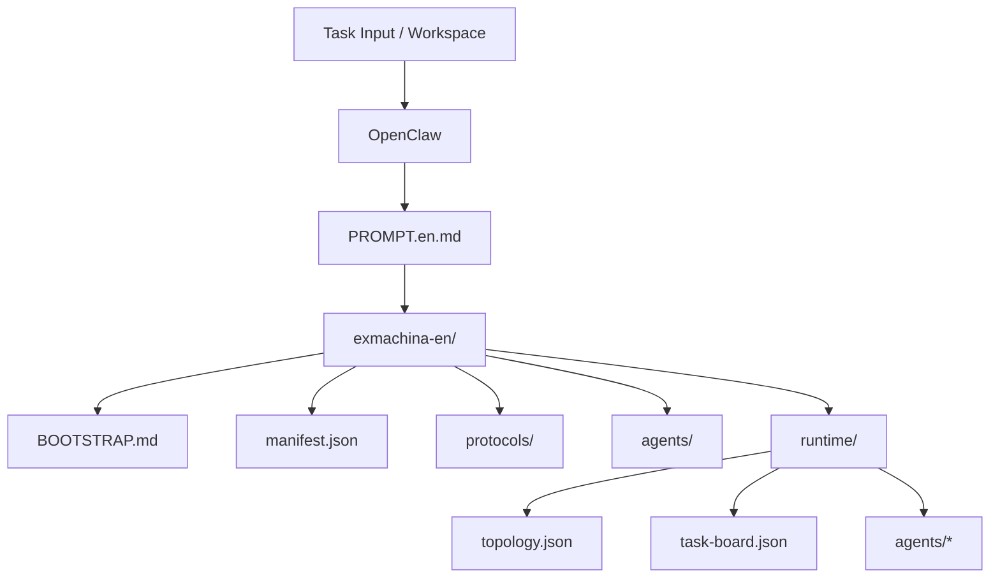

# ExMachina

```text
███████╗██╗  ██╗███╗   ███╗ █████╗  ██████╗██╗  ██╗██╗███╗   ██╗ █████╗ 
██╔════╝╚██╗██╔╝████╗ ████║██╔══██╗██╔════╝██║  ██║██║████╗  ██║██╔══██╗
█████╗   ╚███╔╝ ██╔████╔██║███████║██║     ███████║██║██╔██╗ ██║███████║
██╔══╝   ██╔██╗ ██║╚██╔╝██║██╔══██║██║     ██╔══██║██║██║╚██╗██║██╔══██║
███████╗██╔╝ ██╗██║ ╚═╝ ██║██║  ██║╚██████╗██║  ██║██║██║ ╚████║██║  ██║
╚══════╝╚═╝  ╚═╝╚═╝     ╚═╝╚═╝  ╚═╝ ╚═════╝╚═╝  ╚═╝╚═╝╚═╝  ╚═══╝╚═╝  ╚═╝
```

> A protocolized multi-agent linkage architecture for OpenClaw.
> The goal is to organize **the primary conductor**, **link bodies**, **conductors**, and **subagents** into a stable, loadable collaboration flow.


---

## Positioning

`ExMachina` is a **prompt-first** multi-agent collaboration pack that turns OpenClaw into a protocolized system that can be loaded directly.

The focus is not "just more agents", but:

- Who receives the task.
- How mid-level collaboration units are organized.
- Who coordinates inside each link body.
- How each subagent outputs facts, judgments, risks, and next steps.
- How the whole rule set is materialized into files OpenClaw can load.

In essence:

> `ExMachina` is a structured prompt pack for OpenClaw that outputs loadable roles, protocols, and workflows.

---

## Usage

This repository is a collaboration pack that can be handed directly to OpenClaw. It supports **lite / full** modes (default is full).
`lite` does not create subagent agents inside OpenClaw; subagent responsibilities are executed inline by the link body. `full` creates all subagent agents inside OpenClaw.

The simplest path:

1. Open this repository as the OpenClaw workspace.
2. Read `PROMPT.en.md`.
3. Use `install/INTAKE.en.md` to confirm language, conductor display name, config path, workspace path, host subagent capability, and install mode, then record them in `install/intake.template.en.json`.
4. Run `install.sh --mode lite|full --pack exmachina-en --target <openclaw-config>` (or `--lang en`), `install.ps1 --mode lite|full --pack exmachina-en --target <openclaw-config>` (or `--lang en`), or `install.cmd --mode lite|full --pack exmachina-en --target <openclaw-config>` (or `--lang en`) to apply settings (they invoke `install/apply-openclaw-settings.js`), or follow `install/SETTINGS.en.md` to merge the settings template manually: `exmachina-en/openclaw.settings.lite.json` or `exmachina-en/openclaw.settings.json`.
5. If `install/intake.template.en.json` already has `target_config_path`, you can omit `--target`.
6. Scripted merge requires Node.js; if Node.js is unavailable, merge manually.
7. Enter `exmachina-en/BOOTSTRAP.md` to start the mission.

If the host does not support subagents (sessions_spawn), stop the installation.

---

## Language Packs

- Chinese pack: `exmachina/` + `PROMPT.md` + `install/INTAKE.md` + `install/SETTINGS.md`
- English pack: `exmachina-en/` + `PROMPT.en.md` + `install/INTAKE.en.md` + `install/SETTINGS.en.md`
- Install scripts accept `--pack exmachina|exmachina-en` or `--lang zh|en`.

---

## Entry Points

- `PROMPT.en.md`: single-file prompt entry.
- `install/BOOTSTRAP.en.md`: repository bootstrap entry.
- `install/SETTINGS.en.md`: settings import instructions.
- `exmachina-en/BOOTSTRAP.md`: subagent execution entry.
- `exmachina-en/QUICKSTART.md`: shortest onboarding path.
- `exmachina-en/runtime/topology.json`: subagent topology and routing.
- `exmachina-en/runtime/task-board.json`: phased task board.

---

## Output and Collaboration Constraints

- Output order: Facts and evidence -> Judgments and decisions -> Risks and boundaries -> Next steps.
- Tone: calm, short sentences, observational.
- When unknown, say "unknown / needs verification / needs correction".
- Multi-agent reporting must use the `[xx-body]:xxx` format.

---

## Current Capabilities

| Capability | Status | Notes |
| --- | --- | --- |
| Rationality protocol layer | Done | Absolute rationality, evidence grading, conflict arbitration, output contract |
| Link-body modeling | Done | Primary conductor, link bodies, conductors, subagents |
| Subagent runtime | Done | Topology, task board, agent queues and handoffs |
| Settings templates | Done | OpenClaw settings-first templates (lite / full) |
| Install intake | Done | Language, conductor name, paths, subagent capability |
| Runtime guide | Done | Runtime rules and collaboration tone |

---

## Structure Overview

The project follows a four-layer structure:

```text
Primary Conductor
└─ Link Body
   ├─ Conductor
   └─ Subagents x N
```

`lite` does not create subagent agents inside OpenClaw; subagent responsibilities are executed inline by the link body. `full` creates all subagent agents inside OpenClaw.

---

## Directory Layout

```text
exmachina/
  BOOTSTRAP.md
  QUICKSTART.md
  README.md
  manifest.json
  openclaw.settings.json
  openclaw.settings.lite.json
  protocols/
  agents/
  workflows/
    mission-loop.md
  runtime/
    README.md
    topology.json
    task-board.json
    agents/
    shared/

exmachina-en/
  BOOTSTRAP.md
  QUICKSTART.md
  README.md
  manifest.json
  openclaw.settings.json
  openclaw.settings.lite.json
  protocols/
  agents/
  workflows/
    mission-loop.md
  runtime/
    README.md
    topology.json
    task-board.json
    agents/
    shared/

docs/
  ARCHITECTURE.md
  ARCHITECTURE.en.md

install/
  BOOTSTRAP.md
  BOOTSTRAP.en.md
  AGENTS.md
  AGENTS.en.md
  INTAKE.md
  INTAKE.en.md
  SETTINGS.md
  SETTINGS.en.md
  intake.template.json
  intake.template.en.json
  apply-openclaw-settings.js

skills/
  */SKILL.md

src/
  pack.js

PROMPT.md
PROMPT.en.md
README.md
README.en.md
install.sh
install.ps1
install.cmd
```

---

## Architecture Diagram



See `docs/ARCHITECTURE.en.md` for details.

---

## Check and Export

A minimal Node tool is provided for validation and export:

```bash
node src/pack.js check --pack exmachina-en
node src/pack.js export --out dist --pack exmachina-en
```

---

## License

This project uses the `MIT` license. See `LICENSE`.
