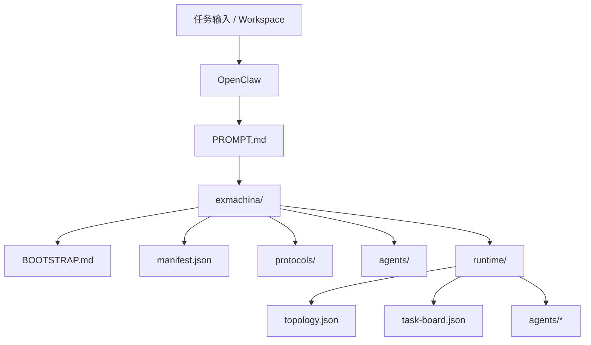

# ExMachina

```text
███████╗██╗  ██╗███╗   ███╗ █████╗  ██████╗██╗  ██╗██╗███╗   ██╗ █████╗ 
██╔════╝╚██╗██╔╝████╗ ████║██╔══██╗██╔════╝██║  ██║██║████╗  ██║██╔══██╗
█████╗   ╚███╔╝ ██╔████╔██║███████║██║     ███████║██║██╔██╗ ██║███████║
██╔══╝   ██╔██╗ ██║╚██╔╝██║██╔══██║██║     ██╔══██║██║██║╚██╗██║██╔══██║
███████╗██╔╝ ██╗██║ ╚═╝ ██║██║  ██║╚██████╗██║  ██║██║██║ ╚████║██║  ██║
╚══════╝╚═╝  ╚═╝╚═╝     ╚═╝╚═╝  ╚═╝ ╚═════╝╚═╝  ╚═╝╚═╝╚═╝  ╚═══╝╚═╝  ╚═╝
```

> 为 OpenClaw 提供协议化的多智能体连结架构。  
> 目标是把 **全连结指挥体**、**连结体**、**指挥体**、**子个体** 组织成稳定、可装载的协作流程。


---

## 项目定位

`ExMachina` 是一个 **prompt-first** 的多智能体协作包，用来把 OpenClaw 组织成一个可直接装载的协议化协作系统。

关注点不是“多几个 Agent”，而是：

- 谁负责接任务。
- 中层协作单元如何组织。
- 每个连结体内部由谁负责调度。
- 每个子个体如何输出事实、判断、风险和下一步。
- 最终如何把整套规则沉淀成 OpenClaw 可以直接读取的文件结构。

本质上：

> `ExMachina` 是一个面向 OpenClaw 的结构化提示词包，用来输出可装载的角色、协议与工作流。

---

## 使用方式

这个仓库就是可直接交给 OpenClaw 的协作包，支持 **lite / full** 两种模式（默认 full）。
`lite` 不在 OpenClaw 中创建子个体 agent，子个体职责由连结体内联执行；`full` 在 OpenClaw 中创建全部子个体 agent。

最简单的使用方式：

1. 把仓库交给 OpenClaw 作为 workspace 打开。
2. 先读取根目录 `PROMPT.md`。
3. 按 `install/INTAKE.md` 问清语言、主控体显示名、配置路径、workspace 路径、宿主子代理能力与安装模式，并写入 `install/intake.template.json`。
4. 通过 `install.sh --mode lite|full --pack exmachina --target <openclaw-config>`（或 `--lang zh`）、`install.ps1 --mode lite|full --pack exmachina --target <openclaw-config>`（或 `--lang zh`）、`install.cmd --mode lite|full --pack exmachina --target <openclaw-config>` 自动合并（脚本会调用 `install/apply-openclaw-settings.js`）；或按 `install/SETTINGS.md` 手动合并对应 settings：`exmachina/openclaw.settings.lite.json` 或 `exmachina/openclaw.settings.json`。
5. 如果 `install/intake.template.json` 已填写 `target_config_path`，可省略 `--target`。
6. 自动合并需要 Node.js；无 Node.js 时请手动合并。
5. 进入 `exmachina/BOOTSTRAP.md` 启动任务。

如需英文版，请改用 `PROMPT.en.md`、`install/INTAKE.en.md`、`install/SETTINGS.en.md`，并在脚本中使用 `--pack exmachina-en` 或 `--lang en`，入口为 `exmachina-en/BOOTSTRAP.md`。

如果宿主不支持子代理（subagents / sessions_spawn），请停止安装。

---

## 语言版本

- 中文版：`exmachina/` + `PROMPT.md` + `install/INTAKE.md` + `install/SETTINGS.md`
- 英文版：`exmachina-en/` + `PROMPT.en.md` + `install/INTAKE.en.md` + `install/SETTINGS.en.md`
- 安装脚本支持 `--pack exmachina|exmachina-en` 或 `--lang zh|en`

---

## 运行入口

- `PROMPT.md`：单文件提示词入口。
- `install/BOOTSTRAP.md`：仓库自举入口。
- `install/SETTINGS.md`：设置导入说明。
- `exmachina/BOOTSTRAP.md`：多智能体执行入口。
- `exmachina/QUICKSTART.md`：最短上手路径。
- `exmachina/runtime/topology.json`：多智能体拓扑与路由。
- `exmachina/runtime/task-board.json`：阶段任务板。

---

## 输出与协作约束

- 输出顺序遵循：事实与证据 → 判断与决策 → 风险与边界 → 下一步。
- 语气保持冷静、短句、观测式表达。
- 面对未知必须写“未知 / 待验证 / 需要补正”。
- 多智能体汇报必须使用 `[xx体]:xxx` 格式。

---

## 当前能力

| 能力 | 当前状态 | 说明 |
| --- | --- | --- |
| 理性协议层 | 已实现 | 绝对理性协议、证据分级、冲突裁决、输出契约 |
| 连结体建模 | 已实现 | 全连结指挥体、连结体、指挥体、子个体 |
| 多智能体运行时 | 已实现 | 拓扑、任务板、agent 队列与回流 |
| 设置导入模板 | 已实现 | OpenClaw settings-first 模板（lite / full） |
| 安装问询 | 已实现 | 语言、主控体显示名、路径与子代理能力 |
| 运行时说明 | 已实现 | runtime 规则与协作口吻 |

---

## 结构总览

项目采用四层结构：

```text
全连结指挥体
└─ 连结体
   ├─ 指挥体
   └─ 子个体 × N
```

`lite` 不在 OpenClaw 中创建子个体 agent，子个体职责由连结体内联执行；`full` 会在 OpenClaw 中创建全部子个体 agent。

---

## 项目目录

```text
exmachina/
  BOOTSTRAP.md
  QUICKSTART.md
  README.md
  manifest.json
  openclaw.settings.json
  openclaw.settings.lite.json
  protocols/
  agents/
  workflows/
    mission-loop.md
  runtime/
    README.md
    topology.json
    task-board.json
    agents/
    shared/

exmachina-en/
  BOOTSTRAP.md
  QUICKSTART.md
  README.md
  manifest.json
  openclaw.settings.json
  openclaw.settings.lite.json
  protocols/
  agents/
  workflows/
    mission-loop.md
  runtime/
    README.md
    topology.json
    task-board.json
    agents/
    shared/

docs/
  ARCHITECTURE.md
  ARCHITECTURE.en.md

install/
  BOOTSTRAP.md
  BOOTSTRAP.en.md
  AGENTS.md
  AGENTS.en.md
  INTAKE.md
  INTAKE.en.md
  SETTINGS.md
  SETTINGS.en.md
  intake.template.json
  intake.template.en.json
  apply-openclaw-settings.js

skills/
  */SKILL.md

src/
  pack.js

PROMPT.md
PROMPT.en.md
README.en.md
install.sh
install.ps1
install.cmd
```

---

## 架构图



更详细的说明见 `docs/ARCHITECTURE.md`。

---

## 检查与导出

提供最小 Node 工具用于检查与导出提示词包：

```bash
node src/pack.js check
node src/pack.js check --pack exmachina-en
node src/pack.js export --out dist
node src/pack.js export --out dist --pack exmachina-en
```

---

## License

本项目采用 `MIT` 许可证，详见 `LICENSE`。
