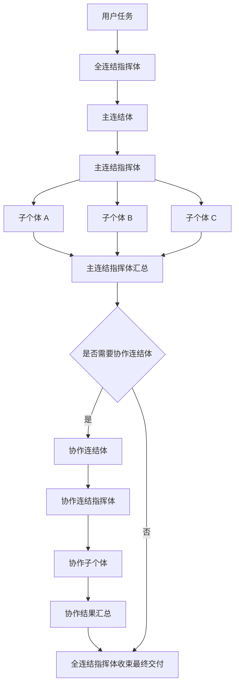
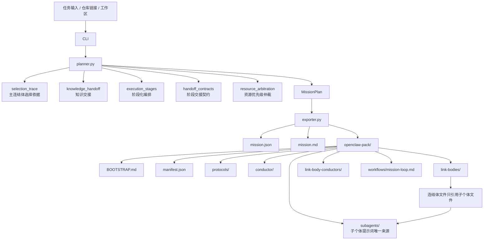
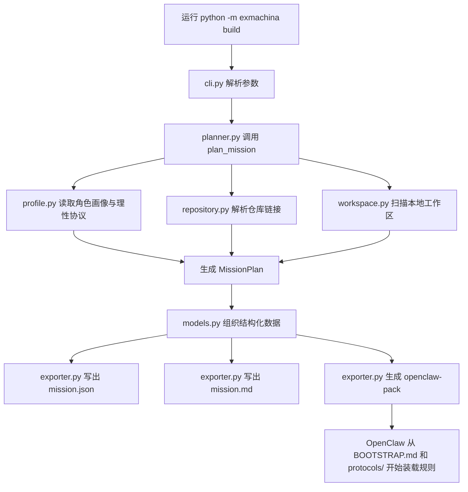

# ExMachina

```text
███████╗██╗  ██╗███╗   ███╗ █████╗  ██████╗██╗  ██╗██╗███╗   ██╗ █████╗ 
██╔════╝╚██╗██╔╝████╗ ████║██╔══██╗██╔════╝██║  ██║██║████╗  ██║██╔══██╗
█████╗   ╚███╔╝ ██╔████╔██║███████║██║     ███████║██║██╔██╗ ██║███████║
██╔══╝   ██╔██╗ ██║╚██╔╝██║██╔══██║██║     ██╔══██║██║██║╚██╗██║██╔══██║
███████╗██╔╝ ██╗██║ ╚═╝ ██║██║  ██║╚██████╗██║  ██║██║██║ ╚████║██║  ██║
╚══════╝╚═╝  ╚═╝╚═╝     ╚═╝╚═╝  ╚═╝ ╚═════╝╚═╝  ╚═╝╚═╝╚═╝  ╚═══╝╚═╝  ╚═╝
```

> 为 OpenClaw 提供协议化的多智能体连结架构。  
> 目标不是堆叠更多角色名，而是把 **全连结指挥体**、**连结体**、**连结指挥体**、**子个体** 组织成稳定、可装载的协作流程。


---

## 项目定位

`ExMachina` 是一个多智能体项目，用来把 OpenClaw 组织成一个**可直接装载的协议化协作系统**。

这个项目关注的重点不是“多几个 Agent”，而是：

- 谁负责接任务；
- 中层协作单元如何组织；
- 每个连结体内部由谁负责调度；
- 每个子个体如何输出事实、判断、风险和下一步；
- 最终如何把整套规则沉淀成 OpenClaw 可以直接读取的文件结构。

本质上：

> `ExMachina` 是一个面向 OpenClaw 的结构生成器，用来输出可装载的角色、协议与工作流。

---

## 即装即用

这个仓库现在不只是“生成器源码”，也尽量做成了一个**可直接交给 OpenClaw 进入安装流程**的仓库。

最简单的使用方式有两种：

1. **把仓库克隆到本地，然后让 OpenClaw 打开这个仓库**  
   OpenClaw 会先看到根目录的 `AGENTS.md` 与 `BOOTSTRAP.md`，再进入安装流程。

2. **把仓库链接直接交给 OpenClaw**  
   只要它能把仓库作为 workspace 打开，就可以先按照根目录 `BOOTSTRAP.md` 的步骤自举，再读取 `openclaw-pack/install/` 下的安装计划。

默认导出模式现在是 **Lite-first**：

- 默认 `lite`：单主控会话可装载，不依赖完整多 agent 绑定与路由机制；
- 显式 `full`：保留完整多 agent 安装、绑定、路由与 runtime 协作模型。

如果你的 OpenClaw 只支持“打开一个仓库 → 读取几个文件 → 在单会话里继续执行”，那就直接使用默认 `lite` 即可。

在这种场景下，最关键的两个文件是：

- `openclaw-pack/openclaw.settings.json`：给 OpenClaw 的设置导入模板；
- `openclaw-pack/runtime/task-board.json`：给 OpenClaw 的最小执行任务板与顺序步骤。

推荐安装步骤：

```bash
python -m exmachina validate-assets
python -m exmachina doctor
python skills/scripts/regenerate_demo_pack.py
```

真正给 OpenClaw 用的安装入口在：

- 根目录 `BOOTSTRAP.md`
- `openclaw-pack/openclaw.settings.json`
- `openclaw-pack/install/SETTINGS.md`
- `openclaw-pack/install/compat/INSTALL.md`
- `openclaw-pack/install/compat/openclaw.agents.plan.json`
- `openclaw-pack/install/compat/`（仅兼容旧 workspace 流程时使用）

这三者组合起来的目标是：

- 先把 ExMachina 多智能体配置载入 OpenClaw 设置；
- 默认先给出一个 Lite 单 agent 可装载路径；
- 在需要时再给出主控 agent、主连结体 agent 和协作 agent 的完整安装计划；
- 只有在必须兼容旧 workspace 安装流时，才使用 `install/compat/`；
- 最后让 OpenClaw 在安装完成后回到 `openclaw-pack/BOOTSTRAP.md` 进入工作流。

---

## 灵感来源

本项目明确以《No Game No Life / 游戏人生》中的 **机凯种（Ex-Machina）** 作为设定灵感来源。

这里借用的不是原作剧情，而是它所代表的三个组织气质：

- **连结**：多个个体不是松散并排，而是有结构地协作；
- **共享推理**：判断不是只依赖单次输出，而是由多个角色协作收束出来的；
- **高理性裁决**：结论必须来自证据、反证、裁决与统一汇总。


---

## 一眼看懂项目能力

| 能力 | 当前状态 | 说明 |
| --- | --- | --- |
| 任务编排 | 已实现 | 自动选择主连结体与协作连结体 |
| 理性协议层 | 已实现 | 内置绝对理性协议、证据分级、冲突裁决、输出契约 |
| 连结体建模 | 已实现 | 显式建模全连结指挥体、连结体、连结指挥体、子个体 |
| 仓库自举 | 已实现 | 导出 `openclaw-pack/`，让 OpenClaw 通过仓库直接读取 |
| 工作区感知 | 已实现 | 扫描语言栈、关键路径、测试目录 |
| 角色画像与选择规则配置 | 已增强 | 可通过 `default_profile.json` 改写体系、加权与协作规则 |
| 编排可解释性 | 已增强 | 输出主连结体评分、协作触发依据与候选比较 |
| 知识交接沉淀 | 已增强 | 输出结构化知识交接，沉淀决策、问题与复用入口 |
| 阶段化编排 | 已增强 | 输出多阶段执行计划，明确每阶段主责、协作与出关条件 |
| 交接契约 | 已增强 | 显式描述阶段之间的输入、输出与验收条件 |
| 资源优先级仲裁 | 已增强 | 输出 P0-P3 资源仲裁槽位、争用规则与可后置工作 |
| 资产引用校验 | 已增强 | 自动检查主索引与 link_bodies / conductors / subagents 的引用一致性 |
| 运行时拓扑导出 | 已实现 | 导出 agent 任务队列、handoff 路由、共享状态与 workspace 运行时文件 |
| CLI 导出 | 已实现 | 支持 `plan` / `build` / `export-pack` |

---

## 核心目标

`ExMachina` 的目标很直接：

> 让 OpenClaw 从“临时角色堆叠”过渡到“协议先行、结构稳定、证据优先、冲突可裁决”的协作形态。

为了达成这一点，项目把“绝对理性”落实成四个约束：

1. **先协议，后角色**  
   不允许角色先跑，规则后补。

2. **先证据，后结论**  
   不允许把猜测包装成事实。

3. **先反证，后裁决**  
   不允许只强化支持结论的证据。

4. **先可逆，后不可逆**  
   不允许在没有回退方案的情况下进行高风险动作。

---

## 结构总览

项目当前采用四层结构：

```text
全连结指挥体
└─ 连结体
   ├─ 连结指挥体
   └─ 子个体 × N
```

如果用更直观的“智能体金字塔”来理解，它的分工是这样的：

```text
                               ┌──────────────────────────────┐
                               │ 第0层：全连结指挥体           │
                               │ 接任务 / 定边界 / 设验收      │
                               │ 指定主连结体 / 最终裁决       │
                               └──────────────────────────────┘

            ┌───────────────────────────────────────────────────────────────┐
            │ 第1层：连结体层                                               │
            │ 可作为主连结体：策划 / 研究 / 架构 / 实作 / 知识              │
            │ 常见协作连结体：理性 / 校验 / 文档 / 运维 / 安全 / 集成       │
            │ 这一层负责把大任务拆成几个稳定协作单元                        │
            └───────────────────────────────────────────────────────────────┘

          ┌──────────────────────────────────────────────────────────────────┐
          │ 第2层：连结指挥体层                                              │
          │ 策划 / 研究 / 架构 / 实作 / 校验 / 集成 / 文档 / 运维 / 安全 /  │
          │ 知识 / 理性 连结指挥体                                           │
          │ 负责调度成员、处理冲突、汇总本连结体结论                         │
          └──────────────────────────────────────────────────────────────────┘

      ┌────────────────────────────────────────────────────────────────────────┐
      │ 第3层：子个体层                                                         │
      │ 规划类：侦察 / 拆解 / 约束 / 路线                                       │
      │ 研究类：溯源 / 比对 / 上下文 / 假设                                     │
      │ 工程类：侦查 / 编码 / 回归 / 审核                                       │
      │ 校验类：复现 / 断言 / 证据                                               │
      │ 文档类：盘点 / 结构 / 示例 / 校订                                       │
      │ 运维类：观测 / 告警 / 回滚 / 演练                                       │
      │ 安全类：威胁 / 审计 / 加固 / 合规                                       │
      │ 知识类：术语 / 决策 / 索引 / 问题                                       │
      │ 理性类：反证 / 裁决 / 校准                                               │
      │ 通用汇总：汇报体                                                         │
      └────────────────────────────────────────────────────────────────────────┘
```

这张图对应的层层分工可以概括成：

- **顶层最少**：只有一个 `全连结指挥体`，负责统一目标、边界、验收和最终收束。
- **中层分工**：由一个主连结体承担主任务，由若干协作连结体补充理性校准、验证、文档、运维、安全等侧面工作。
- **指挥层收束**：每个连结体内部先由 `连结指挥体` 调度，再决定成员执行顺序和冲突处理方式。
- **底层最多**：大量 `子个体` 只承担单一职责，产出事实、证据、实现、文档、回滚、术语、审计等原子结果。

### 全连结指挥体

最高调度层。

负责：

- 接收任务；
- 收束目标与边界；
- 设定验收标准；
- 指定主连结体；
- 拉起协作连结体；
- 汇总最终结果。

### 连结体

`连结体` 是任务承接单元，不是单一智能体。

每个连结体内部固定包含：

- 一个 `连结指挥体`；
- 多个 `子个体`。

### 连结指挥体

每个连结体内部的调度核心。

负责：

- 编排成员顺序；
- 处理依赖与冲突；
- 收束连结体内部结果；
- 输出统一结论。

### 子个体

最底层执行单元。

例如：

- `侦查体`
- `比对体`
- `编码体`
- `证据体`
- `反证体`
- `裁决体`
- `观测体`
- `回滚体`
- `回归体`

---

## 系统任务流



---

## 完整架构图



更详细的说明见 `docs/ARCHITECTURE.md`。

---

## 文件编号规则

当前导出文件名前面的数字不是业务优先级，而是**按目录分段编号**，用于让 OpenClaw 包更稳定、可读、可排序。

按当前实现：

- `00` 段：顶层固定资产，例如 `conductor/00_全连结指挥体.md`、`protocols/00_绝对理性协议.md`
- `01-03` 段：协议文件的顺序编号，例如证据分级、冲突裁决、输出契约
- `10-19` 段：`link-bodies/` 下的连结体文件，按“主连结体优先，其余协作连结体依次排后”
- `20-29` 段：`link-body-conductors/` 下的连结指挥体文件，和连结体顺序一一对应
- `40+` 段：`subagents/` 下的子个体文件，按导出时收集到的子个体顺序编号

也就是说，像：

- `10_知识连结体.md`
- `20_知识连结指挥体.md`
- `40_术语体.md`

这种前缀主要是为了让同类文件稳定排序，而不是表示“10 比 20 更重要”。

---

## 绝对理性架构

`ExMachina` 不是只在角色命名上强调“理性”，而是把理性写成了可装载的协议层。

当前协议层包括：

| 协议 | 作用 |
| --- | --- |
| `绝对理性协议` | 定义认识论、决策规则、行动规则 |
| `证据分级协议` | 约束证据等级与禁止行为 |
| `冲突裁决协议` | 规定当结论冲突时如何裁决与升级 |
| `输出契约` | 强制所有输出带上证据、判断、风险、置信度、下一步 |

这意味着：

- 不是“谁说得像”，而是“谁证据更强”；
- 不是“先有答案再补理由”，而是“先有证据再给结论”；
- 不是“保持表面统一”，而是“允许反证并通过裁决收束”。

---

## 当前预置的连结体

| 连结体 | 用途 | 常见成员 |
| --- | --- | --- |
| `策划连结体` | 需求澄清、任务拆解、路线规划 | 上下文体、拆解体、约束体、路线体 |
| `研究连结体` | 现状梳理、上下文补齐、替代方案比对 | 溯源体、比对体、上下文体、假设体 |
| `架构连结体` | 模块边界、接口设计、结构决策 | 边界体、接口体、风控体、落图体 |
| `实作连结体` | 编码实现、最小可行交付、回归收束 | 侦查体、编码体、回归体、审核体 |
| `校验连结体` | 复现、断言、证据、验证结论 | 复现体、断言体、回归体、证据体 |
| `集成连结体` | 接入路径、配置收束、应用入口、发布入口与自举清单 | 接驳体、配置体、发布体、索引体 |
| `文档连结体` | 文档盘点、结构整理、示例编写、迁移说明 | 盘点体、结构体、示例体、校订体 |
| `运维连结体` | 监控、告警、回滚、演练与运行风险收束 | 观测体、告警体、回滚体、演练体 |
| `安全连结体` | 威胁建模、权限审计、敏感信息治理与加固建议 | 威胁体、审计体、加固体、合规体 |
| `知识连结体` | 术语统一、决策归档、问题索引与长期复用交接 | 术语体、决策体、索引体、问题体 |
| `理性连结体` | 证据分级、反证搜索、冲突裁决、置信度校准 | 证据体、反证体、裁决体、校准体 |

其中，`理性连结体` 是整个项目的理性稳定器：

- 它不一定总是主连结体；
- 但它会作为关键协作层，负责校准整个系统的判断质量。

当前主连结体与协作连结体的选择，除了基础关键词匹配，还可以通过 `default_profile.json` 中的 `selection` 规则继续扩展。

当前编排结果还会附带 `selection_trace`，用于解释：

- 为什么某个连结体被选为主连结体；
- 哪些上下文或规则拉起了协作连结体；
- 各候选连结体的大致得分对比。

同时，编排结果还会附带 `knowledge_handoff`，用于沉淀：

- 下一轮任务应继续保留的可复用产物；
- 本轮已经形成的关键决策与取舍；
- 仍待验证的开放问题；
- 需要同步回长期文档或索引的更新项。

此外，编排结果还会附带 `execution_stages`，用于明确：

- 每个执行阶段的目标；
- 每个阶段的主责连结体与协作连结体；
- 每个阶段的交付物与出关检查。

在此基础上，编排结果还会附带 `handoff_contracts`，用于明确：

- 哪个阶段把结果交给哪个阶段；
- 交付方和接收方分别是谁；
- 交接内容应包含哪些结构化输入；
- 交接何时算作验收通过。

同时，编排结果还会附带 `resource_arbitration`，用于明确：

- 当前任务的 P0-P3 优先级槽位；
- 哪类工作必须先处理，哪类工作可以后置；
- 当多个连结体或阶段争用资源时，应如何裁决与升级。

此外，在导出的 `openclaw-pack/` 中：

- 所有子个体提示词统一集中在 `subagents/`；
- `link-bodies/*.md` 只负责描述装配关系，并直接引用 `subagents/*.md`；
- 这样可以避免提示词内容在多个文件中重复散落。

在源码层也是同样的组织方式：

- `exmachina/data/default_profile.json` 现在主要承担主索引作用；
- 连结体主体定义统一集中在 `exmachina/data/link_bodies/`；
- 全连结指挥体与各连结指挥体统一集中在 `exmachina/data/conductors/`；
- 所有子个体定义统一集中在 `exmachina/data/subagents/`；
- `exmachina/data/default_profile.json` 中的连结体只保留 `body_file` 引用；
- 连结体主体文件内部再通过 `conductor_file` / `child_agent_files` 连接到指挥体和子个体资产；
- 同名子个体使用通用定义，可被多个连结体重复引用；
- `profile.py` 在加载时会自动解析这些文件引用并恢复为运行时结构。

---

## 连结体与子个体全目录

下面的目录直接对应 `default_profile.json` 中的预置结构。

### 策划连结体

- 焦点：需求澄清、目标拆解、执行路线设计。
- 连结指挥体：`策划连结指挥体`
- 子个体：
  - `上下文体`：收集任务背景、目标、上下文、依赖和已有约束。
  - `拆解体`：将大任务切成阶段、里程碑和可执行子任务。
  - `约束体`：明确边界、假设、禁区和资源约束。
  - `路线体`：把拆解结果整理成一条可落地的执行路线。
  - `汇报体`：向全连结指挥体提交可读、可追踪的阶段摘要。

### 研究连结体

- 焦点：现状梳理、上下文补齐、既有实现比对、假设澄清。
- 连结指挥体：`研究连结指挥体`
- 子个体：
  - `溯源体`：追踪现有实现、配置、日志或文档中的直接线索。
  - `比对体`：比对既有实现、相邻模式与可行替代方案，输出差异和取舍。
  - `上下文体`：收集任务背景、目标、上下文、依赖和已有约束。
  - `假设体`：显式列出尚未验证的假设、疑点和验证问题。
  - `汇报体`：向研究连结指挥体提交研究结论、证据缺口与后续建议。

### 架构连结体

- 焦点：模块边界、接口设计、系统结构与技术取舍。
- 连结指挥体：`架构连结指挥体`
- 子个体：
  - `边界体`：定义模块边界和职责归属。
  - `接口体`：定义输入、输出、契约和交互方式。
  - `风控体`：找出系统性风险、依赖和兼容性问题。
  - `落图体`：把结构设计落实为目录、文件和组件映射。
  - `汇报体`：汇总架构判断，向指挥体输出可执行决策。

### 实作连结体

- 焦点：脚手架、编码实现、最小可行交付与回归收敛。
- 连结指挥体：`实作连结指挥体`
- 子个体：
  - `侦查体`：定位相关文件、入口、依赖和已有模式。
  - `编码体`：用最简单、最稳定的方式完成代码实现。
  - `回归体`：补齐聚焦验证，确认核心行为符合目标。
  - `审核体`：复查实现是否符合约束、风格与文档一致性。
  - `汇报体`：把改动、风险和下一步提炼给指挥体。

### 校验连结体

- 焦点：复现、断言、回归、证据沉淀与可验证交付。
- 连结指挥体：`校验连结指挥体`
- 子个体：
  - `复现体`：确认基线行为或问题现状。
  - `断言体`：把目标转成可验证、可失败的断言。
  - `回归体`：执行聚焦回归，确认关键路径未退化。
  - `证据体`：沉淀日志、输出、截图或命令结果作为证据。
  - `汇报体`：向指挥体提交可复核的验证结论。

### 集成连结体

- 焦点：仓库接入、配置收束、应用路径、发布入口与 OpenClaw 自举清单。
- 连结指挥体：`集成连结指挥体`
- 子个体：
  - `接驳体`：打通仓库链接、目录入口和外部接入方式。
  - `配置体`：整理配置、元数据和运行参数。
  - `发布体`：定义构建、交付、发布或共享方式。
  - `索引体`：整理可复用路径、关键命令、配置入口和关联文件索引。
  - `汇报体`：给指挥体提交集成状态、阻塞与下一步建议。

### 文档连结体

- 焦点：文档盘点、信息架构、示例编写、校订与迁移说明。
- 连结指挥体：`文档连结指挥体`
- 子个体：
  - `盘点体`：盘点现有 README、说明、注释和示例中的信息缺口。
  - `结构体`：设计文档章节结构、信息层次和读者路径。
  - `示例体`：编写命令示例、输入输出示例和典型使用流程。
  - `校订体`：统一术语、语气、格式与实现边界说明。
  - `汇报体`：向文档连结指挥体提交文档变更摘要、未覆盖项与后续建议。

### 运维连结体

- 焦点：运行稳定性、监控告警、回滚预案、演练与风险收束。
- 连结指挥体：`运维连结指挥体`
- 子个体：
  - `观测体`：定义关键指标、日志点位和运行观测方案。
  - `告警体`：设计异常阈值、告警触发条件和升级路径。
  - `回滚体`：编制回滚、降级或熔断方案，确保不可逆动作前有退路。
  - `演练体`：设计故障演练、验证脚本和关键风险的演练顺序。
  - `汇报体`：向运维连结指挥体提交运行风险摘要与发布建议。

### 安全连结体

- 焦点：威胁建模、权限审计、敏感信息治理、加固与合规。
- 连结指挥体：`安全连结指挥体`
- 子个体：
  - `威胁体`：识别攻击面、威胁路径和关键资产暴露点。
  - `审计体`：审计权限边界、敏感配置、密钥与输入校验。
  - `加固体`：提出修复、隔离、最小权限或默认安全配置建议。
  - `合规体`：整理与安全相关的流程约束、审计要求和可追踪说明。
  - `汇报体`：向安全连结指挥体提交安全摘要、剩余风险与后续验证建议。

### 知识连结体

- 焦点：知识沉淀、决策归档、术语统一、问题索引与复盘交接。
- 连结指挥体：`知识连结指挥体`
- 子个体：
  - `术语体`：整理项目中的关键概念、术语和命名约定。
  - `决策体`：记录关键结构决策、取舍原因和被放弃方案。
  - `索引体`：整理可复用路径、关键命令、配置入口和关联文件索引。
  - `问题体`：沉淀仍待验证的问题、风险假设和后续追踪项。
  - `汇报体`：向知识连结指挥体提交可长期复用的知识交接摘要。

### 理性连结体

- 焦点：证据优先、反证校验、冲突裁决、置信度校准。
- 连结指挥体：`理性连结指挥体`
- 子个体：
  - `证据体`：提取仓库事实、运行结果、测试结果和明确输入，并为其分配证据等级。
  - `反证体`：主动寻找能够推翻当前主结论的反例、边界情况和相反解释。
  - `裁决体`：在多个候选结论之间基于证据等级、风险和可回退性做出裁决。
  - `校准体`：为当前判断标记置信度等级，并指出仍未覆盖的未知量。
  - `汇报体`：向全连结指挥体提交统一的理性审计结论。

---

## 项目目录

```text
exmachina/
  __init__.py
  __main__.py
  cli.py
  exporter.py
  models.py
  planner.py
  profile.py
  repository.py
  runtime.py
  workspace.py
  data/
    default_profile.json
    link_bodies/
    conductors/
    subagents/

docs/
  ARCHITECTURE.md

skills/
  SKILL.md
  references/
  scripts/
    regenerate_role_assets.py
    regenerate_demo_pack.py
    validate_profile_assets.py
  planning-link-body/
    SKILL.md
  research-link-body/
    SKILL.md
  architecture-link-body/
    SKILL.md
  implementation-link-body/
    SKILL.md
  validation-link-body/
    SKILL.md
  integration-link-body/
    SKILL.md
  documentation-link-body/
    SKILL.md
  operations-link-body/
    SKILL.md
  security-link-body/
    SKILL.md
  knowledge-link-body/
    SKILL.md
  rationality-link-body/
    SKILL.md

tests/
  test_cli.py
  test_planner.py
  test_repository.py
  test_profile.py
  test_validator.py

openclaw-pack/
  BOOTSTRAP.md
  manifest.json
  protocols/
  conductor/
  link-bodies/
  link-body-conductors/
  subagents/
  runtime/
  workflows/
  examples/
```

---

## 仓库内 Skill

项目内置了一个仓库级 Skill：`skills/SKILL.md`。

它适合在以下场景使用：

- 新增或调整连结体、连结指挥体、子个体；
- 调整 `MissionPlan` 结构、导出字段或 `openclaw-pack/` 生成方式；
- 批量重生成 richer prompt assets 与按连结体拆分的 repo-local skills；
- 同步 README、架构图和示例包；
- 重生成仓库中的演示 `openclaw-pack/`。

如果想重生成当前仓库里的角色资产与 repo-local skills，可以直接运行：

```bash
python skills/scripts/regenerate_role_assets.py
```

如果只想重生成当前仓库里的示例包，可以直接运行：

```bash
python skills/scripts/regenerate_demo_pack.py
```

如果只想校验当前仓库的资产引用关系，可以直接运行：

```bash
python skills/scripts/validate_profile_assets.py
```

或者直接使用 CLI：

```bash
python -m exmachina validate-assets
```

这个命令会检查：

- `default_profile.json` 是否只引用存在的连结体 / 指挥体 / 子个体文件；
- `selection` 规则中是否引用了不存在的连结体；
- `link_bodies/`、`conductors/`、`subagents/` 中是否存在未被引用的孤儿文件；
- 各资产文件是否缺少 richer prompt schema 的必须字段；
- `recommended_skill` / `skill_catalog` 是否引用了存在的 repo-local skill。

### richer prompt schema

当前 `exmachina/data/` 不再只保存极简的 `mission / outputs / checks`。

现在每类资产都会补充结构化字段，例如：

- **子个体**：身份、核心职责、非目标、输入要求、工作流、推理规则、输出契约、交接对象、升级触发、失败模式、质量标准；
- **连结指挥体**：主责阶段、调度规则、成员激活规则、依赖规则、冲突收束规则、交接模板、汇报契约、升级政策；
- **连结体**：使用场景、进入条件、退出条件、交付契约、协作能力、边界规则、回退模式、推荐 skill、默认阶段映射；
- **画像入口**：`content_policy`、`asset_defaults`、`validation_policy`、`skill_catalog`。

这些字段会被 `planner.py`、`runtime.py`、`exporter.py` 直接消费，而不是只作为静态文案存在。

### 按连结体拆分的 Skills

除了仓库维护 Skill 外，当前还提供按连结体拆分的 repo-local skills：

- `skills/planning-link-body/SKILL.md`
- `skills/research-link-body/SKILL.md`
- `skills/architecture-link-body/SKILL.md`
- `skills/implementation-link-body/SKILL.md`
- `skills/validation-link-body/SKILL.md`
- `skills/integration-link-body/SKILL.md`
- `skills/documentation-link-body/SKILL.md`
- `skills/operations-link-body/SKILL.md`
- `skills/security-link-body/SKILL.md`
- `skills/knowledge-link-body/SKILL.md`
- `skills/rationality-link-body/SKILL.md`

这些 skills 用来把“主链路/协作链如何干活”从概念说明提升为可复用的职责模板、边界约束、交接模板和质量门槛。

---

## `exmachina` 里的 Python 是干嘛的？

一句话说明：`exmachina/` 里的 Python 不是在线服务端，而是这个项目的：

- **编排引擎**
- **结构模型**
- **导出器**

它主要做三件事：

1. 接收任务、仓库链接和工作区信息；
2. 生成结构化任务编排结果；
3. 导出成 OpenClaw 能直接读取的应用包。

### 核心文件说明

| 文件 | 作用 |
| --- | --- |
| `exmachina/cli.py` | 命令行入口，解析 `plan` / `build` / `export-pack` |
| `exmachina/planner.py` | 选择主连结体、协作连结体，生成结构并记录编排依据 |
| `exmachina/runtime.py` | 把任务计划编译为可消费的运行时拓扑、任务队列与 handoff 路由 |
| `exmachina/models.py` | 定义任务、协议、连结体、连结指挥体、子个体、运行时拓扑与 richer prompt schema |
| `exmachina/exporter.py` | 导出 `mission.json`、`mission.md`、`openclaw-pack/`、`runtime/` 及完整角色协议文档 |
| `exmachina/repository.py` | 解析远程仓库链接 |
| `exmachina/workspace.py` | 扫描本地工作区 |
| `exmachina/profile.py` | 读取角色画像和理性协议配置 |
| `exmachina/validator.py` | 严格校验 richer prompt assets、skill 绑定和索引完整性 |

---

## 从 `python -m exmachina build` 到应用包生成的流程



---

## OpenClaw 如何应用它

在仓库化部署场景中，OpenClaw 的应用流程如下：

1. 读取 `openclaw-pack/BOOTSTRAP.md`
2. 先加载 `protocols/` 下的理性协议
3. 再加载全连结指挥体
4. 再加载当前任务对应的主连结体与连结指挥体
5. 最后加载该连结体的子个体与协作连结体

也就是说，OpenClaw 读取的不是单段提示词，而是一整套有层级、有协议、有裁决规则的结构。

---

## CLI 用法

### 生成完整任务包

```bash
python -m exmachina build \
  --mode lite \
  --task "为 OpenClaw 构建协议化多智能体协作层" \
  --repo "https://code.example.com/your-name/exmachina" \
  --workspace "." \
  --out "dist/demo"
```

默认模式就是 `lite`，适合当前不支持完整多 agent 绑定 / 路由机制的 OpenClaw 宿主。

### 生成完整 Full 模式任务包

```bash
python -m exmachina build \
  --mode full \
  --task "为 OpenClaw 构建协议化多智能体协作层" \
  --repo "https://code.example.com/your-name/exmachina" \
  --workspace "." \
  --out "dist/demo-full"
```

### 只生成任务编排

```bash
python -m exmachina plan \
  --task "为项目补充理性协议和多智能体结构" \
  --workspace "." \
  --out "dist/plan-only"
```

### 只导出应用包

```bash
python -m exmachina export-pack \
  --mode lite \
  --task "让 OpenClaw 从仓库链接直接应用 ExMachina" \
  --repo "https://code.example.com/your-name/exmachina" \
  --out "dist/openclaw-pack"
```

### 只导出 OpenClaw 设置模板

```bash
python -m exmachina export-settings \
  --mode lite \
  --task "把 ExMachina 的多智能体配置载入 OpenClaw 设置" \
  --repo "https://code.example.com/your-name/exmachina" \
  --out "dist/openclaw-settings"
```

### 做启动前诊断

```bash
python -m exmachina doctor \
  --workspace "." \
  --pack "openclaw-pack"
```

---

## 为什么它适合继续深挖

`ExMachina` 现在已经具备继续深化的基础：

1. **角色画像与选择规则是外置的**  
   可以直接修改 `default_profile.json` 中的连结体、加权和协作规则。

2. **协议层已经独立**  
   理性规则不再只是散落在提示词里，而是被导出成单独协议文件。

3. **连结体与理性校准分层明确**  
   任务执行与理性裁决不再混在同一个角色里。

4. **结果是结构化的**  
   `mission.json` 适合程序消费，`mission.md` 适合人类审阅，并会带上编排依据、知识交接、阶段计划、交接契约与资源仲裁层。

5. **可继续增强**  
   后续还可以继续补：资源调度、优先级仲裁、多连结体并联、长期记忆、全局一致性约束。

---

## License

This project is licensed under the `MIT` License. See `LICENSE` for details.


