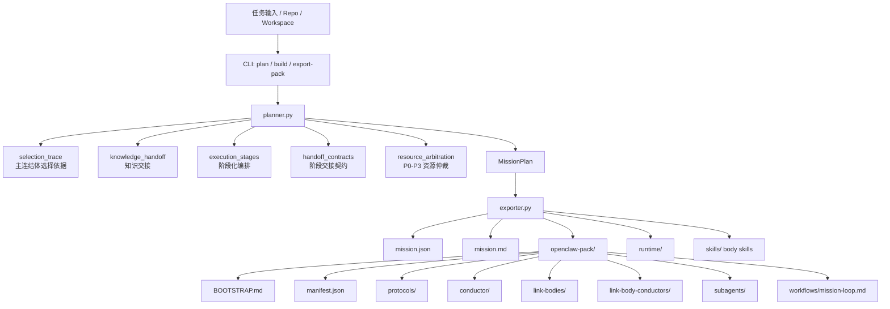
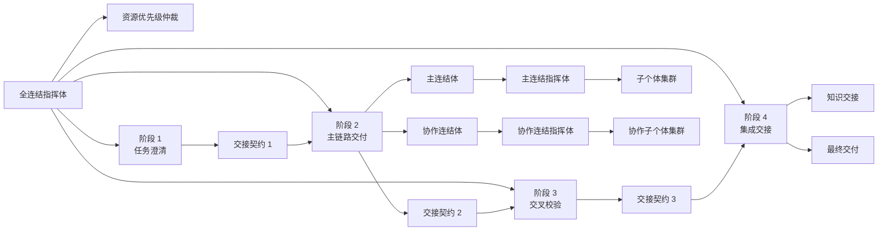

# ExMachina Architecture

## 全景架构图



## 运行时协作图

### 模式说明

- **Lite**：默认模式，只要求单个 `exmachina-main` 会话，主连结体与协作链以内联方式执行，不依赖外部多 agent 绑定与路由。
- **Full**：显式高级模式，保留主控体、主连结体、协作连结体、多 workspace、handoff routes 与状态回流机制。



## 智能体金字塔图

```text
                               ┌──────────────────────────────┐
                               │ 第0层：全连结指挥体           │
                               │ 统一目标 / 边界 / 验收        │
                               │ 最终裁决 / 总体收束           │
                               └──────────────────────────────┘

            ┌───────────────────────────────────────────────────────────────┐
            │ 第1层：连结体层                                               │
            │ 主链候选：策划 / 研究 / 架构 / 实作 / 知识                    │
            │ 协作常客：理性 / 校验 / 文档 / 运维 / 安全 / 集成             │
            │ 负责把任务拆成几个可稳定协作的工作单元                        │
            └───────────────────────────────────────────────────────────────┘

          ┌──────────────────────────────────────────────────────────────────┐
          │ 第2层：连结指挥体层                                              │
          │ 策划 / 研究 / 架构 / 实作 / 校验 / 集成 / 文档 / 运维 / 安全 /  │
          │ 知识 / 理性 连结指挥体                                           │
          │ 负责调度成员、处理依赖、收束冲突、汇总阶段结果                   │
          └──────────────────────────────────────────────────────────────────┘

      ┌────────────────────────────────────────────────────────────────────────┐
      │ 第3层：子个体层                                                         │
      │ 规划类：侦察 / 拆解 / 约束 / 路线                                       │
      │ 研究类：溯源 / 比对 / 上下文 / 假设                                     │
      │ 工程类：侦查 / 编码 / 回归 / 审核                                       │
      │ 校验类：复现 / 断言 / 证据                                               │
      │ 文档类：盘点 / 结构 / 示例 / 校订                                       │
      │ 运维类：观测 / 告警 / 回滚 / 演练                                       │
      │ 安全类：威胁 / 审计 / 加固 / 合规                                       │
      │ 知识类：术语 / 决策 / 索引 / 问题                                       │
      │ 理性类：反证 / 裁决 / 校准                                               │
      │ 通用汇总：汇报体                                                         │
      └────────────────────────────────────────────────────────────────────────┘
```

### 金字塔解读

- **顶层收束**：只有一个全连结指挥体，避免目标和裁决来源分裂。
- **连结体分工**：主连结体负责主交付，协作连结体负责补位、制衡和横向能力支持。
- **指挥体编排**：每个连结体内部先经由连结指挥体再派发给子个体，避免并发输出互相打架。
- **子个体原子化**：最底层由大量单一职责子个体组成，便于复用、验证和替换。

## 结构演化原则

- 角色拓扑变更先改 `exmachina/data/default_profile.json`。
- 结构字段变更必须同时同步 `models.py`、`planner.py`、`exporter.py`。
- `exmachina/data/default_profile.json` 应尽量只保留索引信息，把连结体主体放在 `exmachina/data/link_bodies/`。
- 源码层的全连结指挥体与各连结指挥体定义集中在 `exmachina/data/conductors/`，`default_profile.json` 只保留 `conductor_file` 引用。
- 源码层的子个体定义集中在 `exmachina/data/subagents/`，`default_profile.json` 只保留 `child_agent_files` 引用；同名子个体应尽量复用通用定义。
- richer prompt schema 变更后，必须同步校验 `validator.py`、导出文档和 runtime JSON。
- repo-local body skills 应与 `recommended_skill` / `skill_catalog` 保持一致。
- 在结构演化后，应运行 `python -m exmachina validate-assets` 检查索引是否悬空、缺失或出现孤儿文件。
- 在结构演化后，应运行 `python -m unittest discover -s tests -p "test_*.py"` 验证 planner、exporter、runtime 与 assets 一致。
- 子个体提示词应集中维护在 `openclaw-pack/subagents/`，连结体文件只负责引用，不重复内嵌。
- 生成产物变更后应重生成仓库内 `openclaw-pack/`。
- README 和本文件应始终能解释当前代码实际导出的结构。
